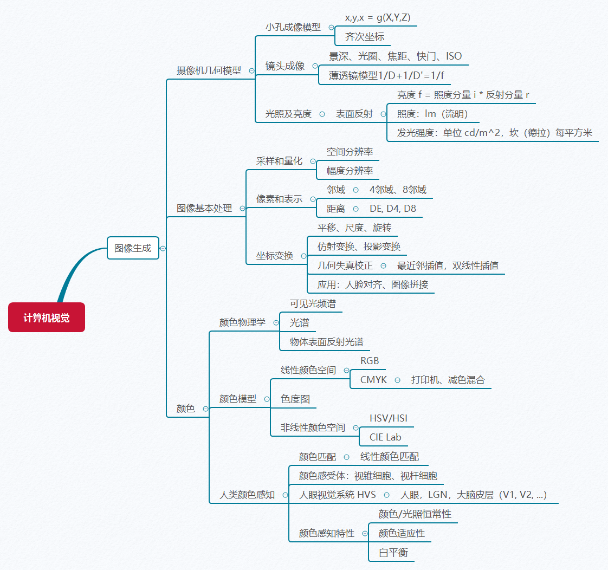
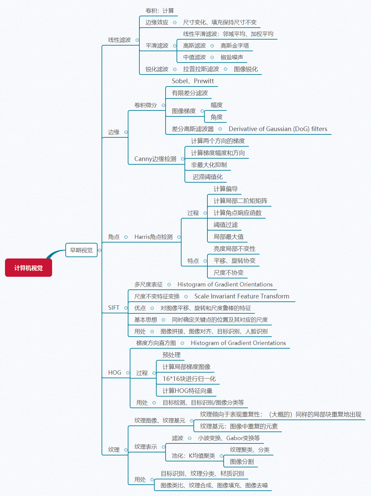
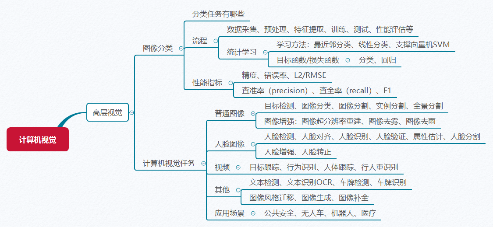

# 计算机视觉（基础）

> Computer Vision Foundations

【[主页](https://aiart.live/courses/)】【[深度学习](https://aiart.live/courses/dl.html)】【[计算机视觉](https://aiart.live/courses/cv.html)】【[数字图像处理](https://aiart.live/courses/dip.html)】【[人工智能导论](https://aiart.live/courses/intro2ai.html)】

## 基本信息

- 授课教师：[高飞](http://aiart.live) @ 杭电
- 授课学期：2020-2021-2学期
- 参考教材：
  - 《计算机视觉：算法与应用》
    [Computer Vision: Algorithms and Applications](https://szeliski.org/Book/), by Richard Szeliski
  - Programming Computer Vision with Python, Jan Erik Solem

## 课程内容

| 周次   | 内容 / 课件                                  | 作业                                |
| ---- | ---------------------------------------- | --------------------------------- |
| 1    | [课程简介](计算机视觉基础/CV-01课程简介.pdf)：内容安排、课程背景  | [作业0：前沿科技资讯](计算机视觉基础/TechNews.md) |
| 2    | 图像生成：[成像模型、图像采集](计算机视觉基础/CV-02图像生成：图像采集.pdf) |                                   |
| 3    | 图像生成：[坐标变换](计算机视觉基础/CV-04图像生成：坐标变换.pdf)  | [作业1：图像坐标变换](计算机视觉基础/作业1图像生成.md)  |
| 4    | 图像生成：[彩色](计算机视觉基础/CV-03图像生成：颜色.pdf)      |                                   |
| 5    | 早期视觉：[线性滤波](计算机视觉基础/CV-05早期视觉：线性滤波.pdf)  | [作业2：线性滤波](计算机视觉基础/作业2线性滤波.md)    |
| 6    | 早期视觉：[边缘](计算机视觉基础/CV-06早期视觉：边缘.pdf)      | [作业3：边缘检测](计算机视觉基础/作业3边缘检测.md)    |
| 7    | 早期视觉：[角点](计算机视觉基础/CV-07早期视觉：角点corner.pdf) |                                   |
| 8    | 早期视觉：[HOG、SIFT](计算机视觉基础/CV-08早期视觉：HOG-SIFT.pdf) |                                   |
| 9    | 早期视觉：[纹理](计算机视觉基础/CV-09早期视觉：纹理.pdf)      | [纹理聚类](计算机视觉基础/作业4纹理聚类.md)        |
| 10   | 高级视觉：[图像分类](计算机视觉基础/CV-10图像分类.pdf)       |                                   |
| 11   | 高级视觉：[深度学习及其在计算机视觉中的应用](计算机视觉基础/CV-11深度学习及其在计算机视觉中的应用.pdf) |                                   |
| 12   | [复习](计算机视觉基础/cv_all.png)                 |                                   |

## 内容提纲

## 参考资料

- Computer Vision: A Modern Approach by David Forsyth and Jean Ponce (2nd ed.)

- [Computer Vision: Algorithms and Applications](https://szeliski.org/Book/), by Richard Szeliski

- [计算摄影学 @ 知乎](https://www.zhihu.com/column/hawkcp)

- Programming Computer Vision with Python, Jan Erik Solem

- [CS543/ECE549 Computer Vision, UIUC](https://courses.engr.illinois.edu/)

  ​

