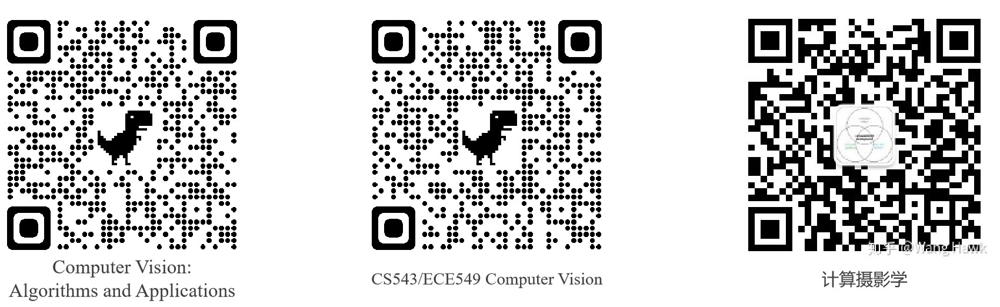

# 计算机视觉基础 Computer Vision

## 基本信息

- 授课学期：2020-2021-2学期
- 参考教材：
  - 《计算机视觉：算法与应用》Computer Vision: Algorithms and Applications, by Richard Szeliski, https://szeliski.org/Book/
  - Programming Computer Vision with Python, Jan Erik Solem

## 课程内容

| 周次   | 内容 / 课件                                 | 作业                               |
| ---- | --------------------------------------- | -------------------------------- |
| 1    | [课程简介](计算机视觉基础/课程简介.pdf)：内容安排、课程背景      |                                  |
| 2    | 课程简介：视觉媒体、视觉任务                          |                                  |
| 3    | 图像生成：[成像模型、图像采集](计算机视觉基础/图像生成：图像采集.pdf) |                                  |
| 4    | 图像生成：[坐标变换](计算机视觉基础/坐标变换.pdf)           | [作业1：图像坐标变换](计算机视觉基础/作业1图像生成.md) |
| 5    | 图像生成：[彩色](计算机视觉基础/彩色.pdf)               | 前沿科技资讯                           |
| 6    | 早期视觉：线性滤波                               | 图像滤波                             |
| 7    | 早期视觉：角点、Harris角点检测                      |                                  |
| 8    | 早期视觉：纹理、HOG、SIFT                        |                                  |
| 9    | 图像分类                                    |                                  |
| 10   | 线性分类、SVM                                | 纹理分类 Scikit-learn                |
| 11   | 卷积神经网络 CNN                              |                                  |
| 12   | 基于CNN的图像分类                              | 基于CNN的图像分类：FashionMNIST          |
| 13   | 人脸检测与识别                                 | 人脸检测与识别                          |
| 14   | 目标检测与分割                                 |                                  |
| 15   | 生成对抗网络及其应用                              |                                  |
| 16   | 复习                                      |                                  |

## 参考资料

- Computer Vision: A Modern Approach by David Forsyth and Jean Ponce (2nd ed.)
- Computer Vision: Algorithms and Applications, by Richard Szeliski, https://szeliski.org/Book/
- 计算摄影学 @ https://www.zhihu.com/column/hawkcpProgramming 
- Computer Vision with Python, Jan Erik Solem
- CS543/ECE549 Computer Vision, UIUC, https://courses.engr.illinois.edu/

