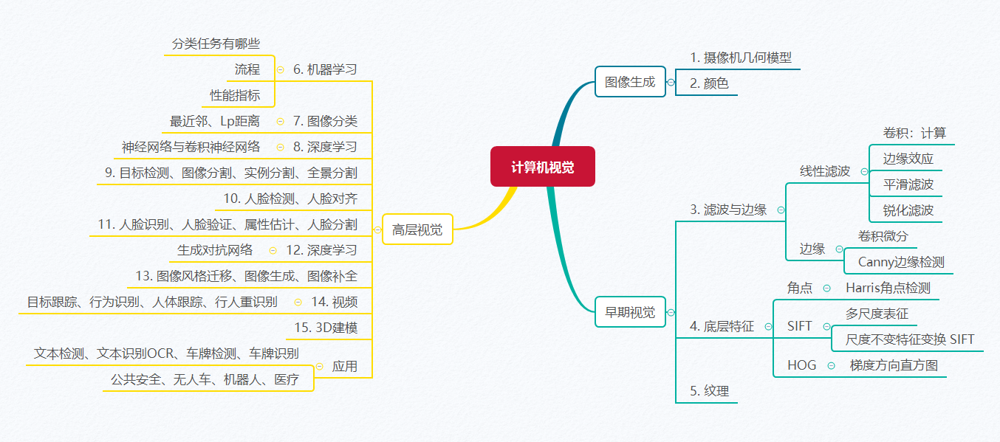

# 计算机视觉

> Computer Vision

【[课程列表](https://aiart.live/courses/)】

## 基本信息

- 授课教师：[高飞](http://aiart.live) @ 杭电·计算机学院
- 授课学期：2021-2022-1学期
- 参考教材：
  - **计算机视觉：原理、算法、应用及学习（第五版）** 
  - **CS231n**，斯坦福大学，李飞飞，http://cs231n.stanford.edu/
  - **Programming Computer Vision with Python**, Jan Erik Solem
  - **动手学深度学习** https://zh.d2l.ai/

## 课程内容

| 内容 / 课件                                  | 作业                                       |
| ---------------------------------------- | ---------------------------------------- |
| [课程简介](计算机视觉/CV-01课程简介.pdf)：内容安排、课程背景    |                                          |
| 图像生成：[图像采集](计算机视觉/CV-02图像生成-图像采集.pdf)    | [作业0：前沿科技资讯](计算机视觉基础/TechNews.md)        |
| 图像生成：[颜色](计算机视觉/CV-03图像生成-颜色.pdf)        | 练习1（可选）：[颜色变换](计算机视觉基础/作业1图像生成.md)       |
| 图像生成：[坐标变换](计算机视觉/CV-04图像生成-坐标变换.pdf)    | 练习2（可选）：人脸对齐                             |
| 早期视觉：[线性滤波](计算机视觉/CV-05早期视觉-线性滤波.pdf)、[边缘](计算机视觉/CV-06早期视觉-边缘.pdf) | 练习3（可选）：[线性滤波](计算机视觉基础/作业2线性滤波.md)、[边缘检测](计算机视觉基础/作业3边缘检测.md) |
| 早期视觉：[角点](计算机视觉/CV-07早期视觉-角点corner.pdf)、[HOG、SIFT](计算机视觉/CV-08早期视觉-HOG-SIFT.pdf) |                                          |
| 早期视觉：[纹理、K均值聚类](计算机视觉基础/CV-09早期视觉-纹理.pdf) | [作业1：纹理聚类](计算机视觉基础/作业4纹理聚类.md)           |
| 高级视觉：[机器学习基本概念]()                        |                                          |
| 高级视觉：[图像分类基础、K近邻方法 ](计算机视觉基础/CV-10图像分类.pdf) | [作业2：基于K近邻的图像分类]()                       |
| 高级视觉：[深度学习基础：CNN]()                      |                                          |
| 高级视觉：目标识别、人脸识别                           | [作业5：基于CNN的图像分类]()                       |
| 高级视觉：目标检测、人脸检测、图像分割                      |                                          |
| 高级视觉：[图像生成：GAN]()                        |                                          |
| 高级视觉：风格迁移、图像变换                           |                                          |
| 高级视觉：[视频：目标跟踪、行为识别]()                    | [作业6：深度学习前沿论文阅读及复现]()                    |
| 高级视觉：[立体视觉]()                            |                                          |
| [复习](计算机视觉基础/cv_all.png)                 |                                          |

## 内容提纲

## 参考资料

- **计算机视觉：原理、算法、应用及学习（第五版）** 

- **CS231n**，斯坦福大学，李飞飞，http://cs231n.stanford.edu/

- **Programming Computer Vision with Python**, Jan Erik Solem

- **动手学深度学习** https://zh.d2l.ai/

- Computer Vision: A Modern Approach by David Forsyth and Jean Ponce (2nd ed.)

- [Computer Vision: Algorithms and Applications](https://szeliski.org/Book/), by Richard Szeliski

- [计算摄影学 @ 知乎](https://www.zhihu.com/column/hawkcp)

- [CS543/ECE549 Computer Vision, UIUC](https://courses.engr.illinois.edu/)

  ​

