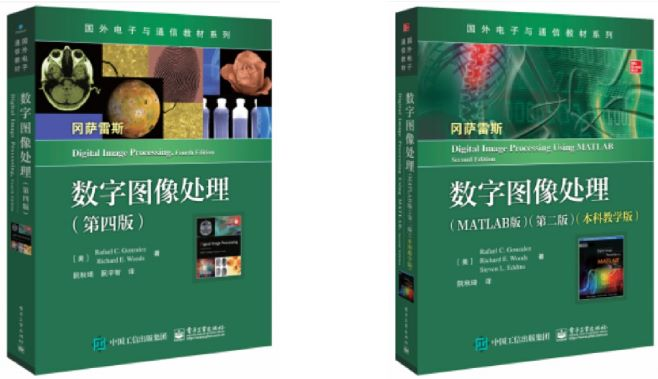
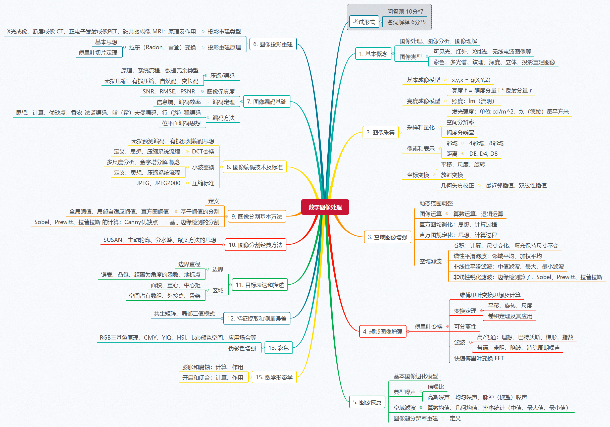

# 数字图像处理

> Digital Image Processing

【[主页](https://aiart.live/courses/)】【[深度学习](https://aiart.live/courses/dl.html)】【[计算机视觉](https://aiart.live/courses/cv.html)】【[数字图像处理](https://aiart.live/courses/dip.html)】【[人工智能导论](https://aiart.live/courses/intro2ai.html)】

## 基本信息

- 授课教师：[高飞](http://aiart.live) @ 杭电

- 授课学期：2021-2022-2学期

- 参考教材：[英文网站](https://www.imageprocessingplace.com/index.htm)
  
  

## 课程内容

**PPTX Slides:** 【[Google Drive](https://drive.google.com/file/d/1kBmLd-Ik4n2GndXj-rt86rzVzGmG6qqS/view?usp=sharing)】【[坚果云](https://www.jianguoyun.com/p/DdvpZIgQ7dvLCxiM94QFIAA)】【[2020版本](数字图像处理/2020)】

| 序号  | 内容                                                                                                    |
|:---:| ----------------------------------------------------------------------------------------------------- |
| 01  | [绪论](数字图像处理/2022/DIP-2-01绪论.pdf)                                                                      |
| 02  | [图像采集I：视觉感知、电子波谱、采样量化](数字图像处理/2022/DIP-2-02图像采集I.pdf)                                                 |
| 03  | [图像采集II：邻域、距离](数字图像处理/2022/DIP-2-02图像采集II.pdf)                                                        |
| 04  | [灰度变换](数字图像处理/2022/DIP-2-03灰度变换.pdf)                                                                       |
| 05  | [空间滤波：平滑、锐化、增强](数字图像处理/2022/DIP-2-04空间滤波.pdf)                                                         |
| 06  | [频域滤波-1D傅里叶变换](数字图像处理/2022/DIP-2-05频域滤波-1D傅里叶变换.pdf), [2D傅里叶变换](数字图像处理/2022/DIP-2-06频域滤波-2D傅里叶变换.pdf) |
| 07  | [图像复原与重建](数字图像处理/2022/DIP-2-07图像复原与重建.pdf)                                                            |
| 08  | [彩色图像处理](数字图像处理/2022/DIP-2-08彩色图像处理.pdf)                                                              |
| 09  | [小波和多分辨率处理](数字图像处理/2022/DIP-2-09小波和多分辨率处理.pdf)                                                        |
| 10  | [图像压缩](数字图像处理/2022/DIP-2-10图像压缩.pdf)                                                                  |
| 11  | [图像分割、目标表达、形态学](数字图像处理/2022/DIP-2-11图像分割、目标表达、形态学.pdf)                                                |

## 其他参考资料

- 数字图像处理（第四版），冈萨雷斯 
  
  Python编程参考：Programming Computer Vision with Python, Jan Erik Solem
  
  ​
